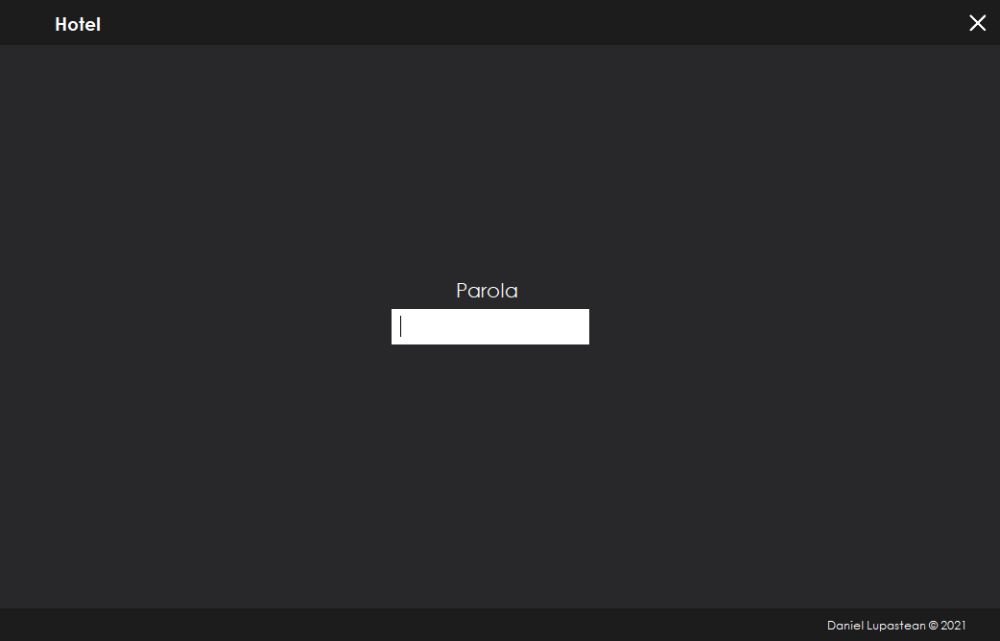
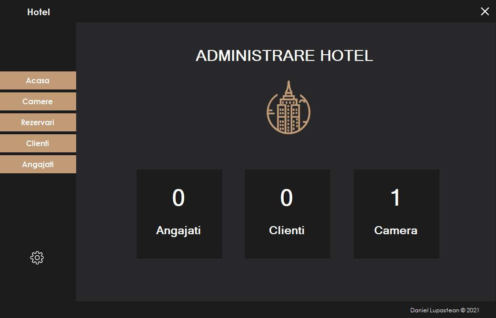
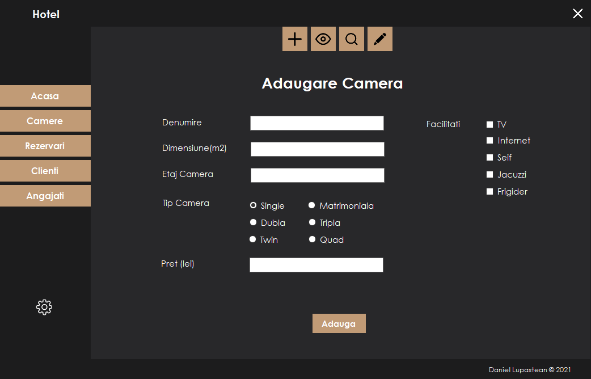
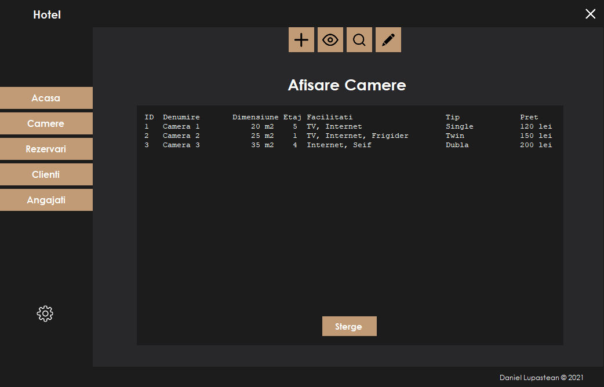
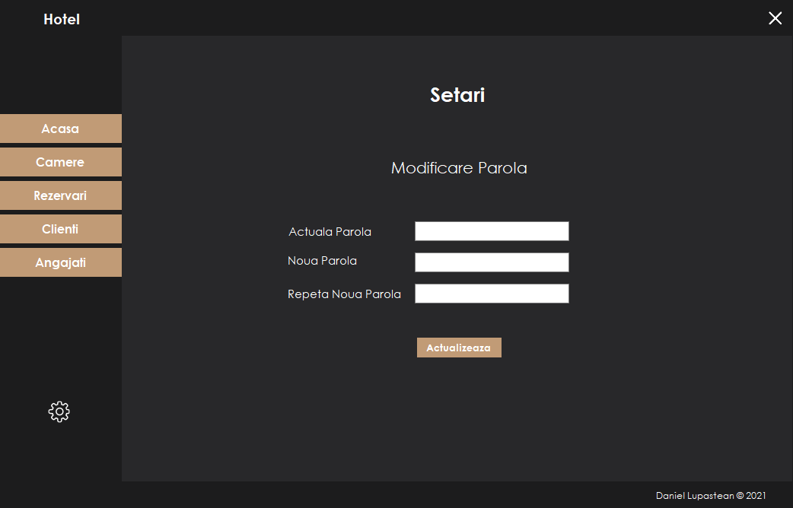

## Hotel Management System - C# Windows Forms App
### UI Design Progect - 2021

- built in C#
- all data about the entities created is stored in files
- used OOP principles: inheritance, abstraction and polymorphism

## Preview Images:

